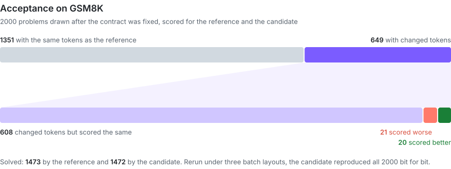
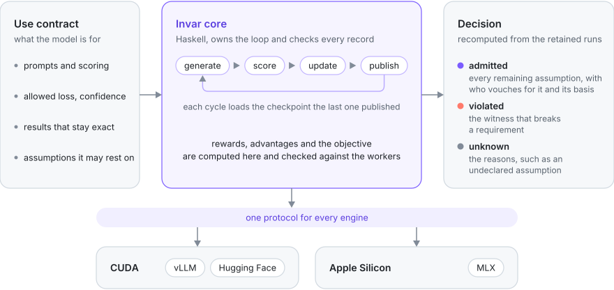
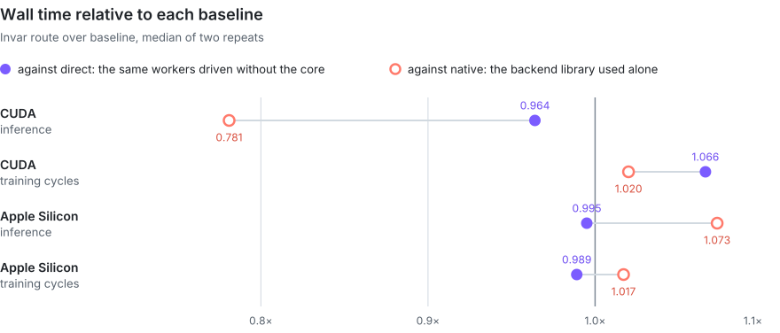

<p align="center">
<picture>
<source media="(prefers-color-scheme: dark)" srcset="docs/images/logo-dark.svg">

</picture>
</p>

<h3 align="center">Noise or real change?</h3>

<p align="center">
When a new kernel changes your model's numbers, Invar decides whether the evidence supports the replacement for a use you declare, with a confidence bound, and says so when it cannot tell.
</p>

<p align="center">
<a href="LICENSE"></a>


</p>

<p align="center">
<a href="docs/design/contract.md">Contract</a> |
<a href="docs/design/loop.md">Training loop</a> |
<a href="docs/backends/vllm.md">CUDA backend</a> |
<a href="docs/backends/mlx.md">Apple Silicon backend</a> |
<a href="docs/results/acceptance.md">Acceptance</a> |
<a href="docs/results/performance.md">Performance</a>
</p>

## About

Invar is a framework for running reinforcement learning and inference on large language models. vLLM, Hugging Face and MLX run the model, and Invar's Haskell core drives them: it binds every worker report to the call it was issued for and recomputes every reward, advantage and loss term. From the retained runs, Invar decides whether a changed numerical implementation, such as a new kernel, may replace the one you trust, and records the evidence behind that decision.

The decision has to be made on the whole model. Optimized kernels rarely match the reference bit for bit, and a small difference in one operator can grow over hundreds of decoding steps until a sampled token changes. Whether that change is acceptable depends on what the model is used for, so the check runs end to end on the model's real task.

Invar weighs the evidence in three steps. It first requires the candidate to give bit identical tokens and probabilities under the batch layouts the contract declares, so those layouts did not move its results; layouts that were not run are not covered, and the reference is not required to be invariant. It then runs the reference and the candidate on the same prompts with the same seeds, which pairs the comparison but does not couple sampling across two engines. Finally it bounds the task loss increase with a finite sample confidence bound over a declared population of prompts, and when the bound cannot establish the requirement the answer is Unknown. Every number the decision uses is bound to the call that produced it. The core recomputes the metrics, the scalar objective and the statistical bounds; logits, model probabilities, gradients and optimizer updates come from the engines. The decision can therefore be recomputed from the records, but the model numbers themselves are not independently verified.

Invar turns that judgement into a contract. The contract names the prompts the model will see, how each response is scored, how much the score may drop and with what confidence, which results must stay exactly the same, and which outside assumptions the decision may rest on. Invar runs the reference and the candidate with `invar infer`, and `invar use admit` rechecks every retained record and gives one of three answers: the candidate is admitted, the contract is violated, or the evidence does not decide it. Serving engines offer deterministic modes, kernel harnesses compare single operators, and statistical tests compare scores; none of them checks invariance under the declared schedules before comparing, bounds the task loss over a declared population for a stated use, and records what the decision assumes.

## Use cases

| Use | What Invar provides |
| --- | --- |
| Changing the inference stack inside an RL loop, such as a new kernel, an engine upgrade or lower precision | admission only when the task loss stays within the bound the contract declares |
| Checking kernels written by an agent | an end to end decision on the real task, where unit tests on one operator miss differences that grow over decoding |
| Keeping the learner consistent with the rollout engine | proximal and current probabilities taken from the engine's own samples and checked bit for bit by the core, with a per cycle measurement of how far the learner's log probability of each sampled token differs from the engine's |
| Reproducible training | `invar compare histories` shows that two runs which scheduled their work differently published the same policies bit for bit |

So far this has been shown for one model and one task, described under Results.

## Results

<p align="center"></p>

The first acceptance ran Qwen3.8-27B on one GH200. The reference and the candidate were two frozen packages built for it, each with its own snapshot of the worker and its own overlays, so the admission applies to those packages rather than to the worker in this repository. The reference was vLLM with FP32 LoRA. Stock vLLM can give one prompt slightly different numbers depending on which other requests share its batch, because the order of floating point additions follows the batch layout. The candidate targets that dependence with two changes: NF4 matrix multiplication always takes the same kernel path, and softmax computes each row on its own in fixed blocks of 1024 columns. Its runs under three batch layouts matched bit for bit.

The contract admitted the candidate. Its task loss rose by 0.0005, one problem in 2000, and the confidence bound on that increase stayed within what the contract allows. Every remaining assumption is recorded with the party that vouches for it and a digest of its basis. The [acceptance results](docs/results/acceptance.md) explain how each value was set.

`invar use admit` also reports common tests on the same records as diagnostics; the decision rests only on the contract's Bernstein bound. A paired Wald interval gives [-0.0058, 0.0068] for the loss increase. An exact McNemar test on the 21 problems that got worse and the 20 that got better gives a one sided p of 0.5, which finds no difference in that direction but does not show that the increase is within the contract's allowance. A Hoeffding bound, which ignores the variance, is too loose to establish the requirement.

## Measurements

For each prompt, Invar compares the two implementations token by token. It finds the first token where they diverge, checks whether their probabilities are identical down to the last bit, and adds up the log probability difference over the tokens they share. To see how the candidate behaves on the same context after the outputs split, it feeds the reference's own response through the candidate and scores every step. At chosen steps it captures the probability of every token in the vocabulary from both sides and bounds the KL divergence between them in each direction.

These measurements sit next to the task score. A candidate can show a large KL on a few tokens while its task score stays within bounds, and the contract states which of the two matters for the use at hand. The task bound is a confidence bound over the sampled prompts, so it holds for the declared population of prompts at the stated confidence, under the assumptions the decision records.

The same records measure the gap between the learner and the inference engine. In each training cycle the rollout and the update start from the same weights, so the learner's log probability of a sampled token should equal the engine's. Most of the gap came from the two sides computing different distributions: the engine samples at the request temperature, and the learner scored tokens at temperature 1. The core admits only rollouts of the policy being updated, so the learner now takes its proximal probabilities from the engine's own samples, the core checks that they match bit for bit, and the learner computes only the gradient, at the rollout temperature. Because the objective uses the engine's values for the proximal, current and behavior probabilities, the importance weight between the rollout and the update is exactly 1; this does not mean the learner's distribution matches the engine's. `invar inspect history` reports that remaining gap in every cycle: the learner's log probability of each sampled token at the rollout temperature against the engine's (linearized minus behavior). On CUDA, with vLLM generating and Hugging Face training, the code of commit `0275232` matched exactly on 42% and 45% of tokens in two updates, with a 99th percentile gap of 0.11 and 0.12 nats and a maximum of 0.31 and 0.45 (GH200 job 6893742), where 1.3% to 1.8% had matched before with a maximum of 1.7. On Apple Silicon, where MLX does both, 45% matched with a maximum of 0.31 in a run of the learner at commit `64e5a59`, before the current role identities. The reference probabilities for the KL term also come from the engine on both backends: when the reference differs from the policy, the engine scores the sampled tokens under the reference adapter in the same rollout.

## Architecture

<p align="center"></p>

In each cycle the core collects responses for a declared set of prompts, scores them, computes advantages and the training objective, runs one update and publishes a checkpoint that the next round of generation must load. The core computes rewards, advantages and the objective itself and compares them with what the workers report.

Python workers do the heavy computation: vLLM generates and Hugging Face trains on CUDA, and MLX does both on Apple Silicon. The core talks to both backends through one invocation protocol. A new inference engine joins by implementing it, and a new learner also needs its checkpoint format checked in the core.

| Command | Purpose |
| --- | --- |
| `invar train` | run the training loop |
| `invar evaluate` | evaluate a fixed policy |
| `invar infer` | make a single inference call |
| `invar compare numerical`, `invar score` | take the measurements above |
| `invar use admit` | decide admission under a use contract |
| `invar compare histories` | check that two runs which scheduled their work differently published the same policies |

## Performance

<p align="center"></p>

In the measurements recorded for the code of commit `696514e`, running the loop through Invar took at most 7% more wall time than running the same workers without it, for inference and for full training cycles on both platforms. The chart also compares Invar with vLLM and MLX used on their own, with their own batching and numerical settings. The [performance results](docs/results/performance.md) give throughput and memory.

## Documentation

| Document | Covers |
| --- | --- |
| [Contract](docs/design/contract.md) | requests, programs, use contracts, evidence and admission |
| [Training loop](docs/design/loop.md) | the loop the core owns, cycle by cycle |
| [CUDA backend](docs/backends/vllm.md) | the CUDA worker on vLLM and Hugging Face, with NF4 and FP32 LoRA |
| [Apple Silicon backend](docs/backends/mlx.md) | the Apple Silicon worker on MLX |
| [Acceptance](docs/results/acceptance.md) | the first acceptance and how its values were set |
| [Performance](docs/results/performance.md) | cost against the direct and native baselines |
| [Patches](patches/README.md) | the pinned vLLM and plugin patches |

## Development

<details>
<summary>Toolchain and the local checks CI runs</summary>

Toolchain: GHC 9.14.1, cabal-install 3.18.1.0, Fourmolu 0.20.1.0 ([fourmolu.yaml](fourmolu.yaml)) and HLint 3.10. Worker dependencies are pinned in [worker/requirements.txt](worker/requirements.txt) and [worker/locks/](worker/locks).

```sh
cabal build all --enable-tests
cabal test all --test-show-details=direct
cabal exec -- sh test/types.sh ghc
fourmolu --mode check $(git ls-files '*.hs')
hlint src test app
cabal exec -- ghc -XGHC2021 -Wall -Werror -package invar -outputdir dist-newstyle/confidence -o dist-newstyle/confidence/reference test/confidence/Main.hs
python3 test/confidence/check.py dist-newstyle/confidence/reference
export PATH="$(dirname "$(cabal list-bin exe:invar)"):$PATH"
python -B -m unittest worker.tests.invocation worker.tests.probepacked worker.tests.probestore
python -B -m unittest discover -s worker/tests/hf -t . -p '*.py'
```

`test/types.sh` compiles every fixture in `test/accept` and requires each fixture in `test/reject` to fail with the diagnostic in its `-- Reject:` line. `test/confidence/check.py` compares the core's Hoeffding and empirical Bernstein bounds with 120 digit decimal arithmetic and requires each to be sound and within 1e-12. The `worker/tests/mlx` and `worker/tests/vllm` packages run the same way on Apple Silicon and on a CUDA host.

</details>

Contributions follow [CONTRIBUTING.md](CONTRIBUTING.md) under [Apache-2.0](LICENSE).
